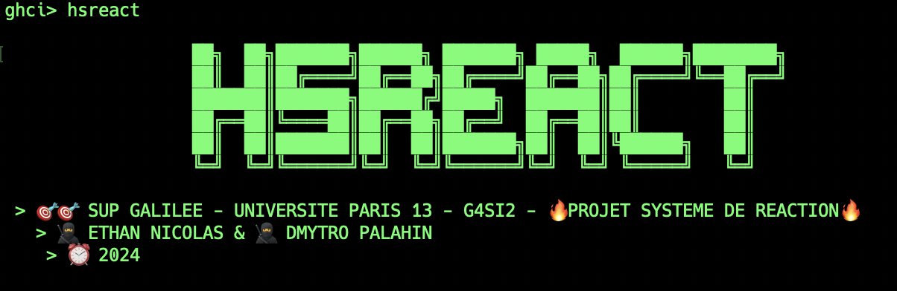

# 🧪 Systèmes de Réactions en Haskell 🧪



## 🚀 Projet

Bienvenue dans le mini-projet **Système de Réaction** développé par **Ethan Nicolas** et **Dmytro Palahin** basé sur les recherches de notre professeur **Carlos Olarte**. Ce projet vise à modéliser et analyser des systèmes de réaction chimique en utilisant des séquences d'entités et des réactions définies.

## 🎯 Table des Matières

1. Introduction
2. Fonctionnalités
3. Installation
4. Utilisation

## 🎬 Introduction

Ce projet permet de modéliser des systèmes de réaction chimique et de vérifier diverses propriétés logiques sur les séquences d'entités générées par ces systèmes. Les principales fonctionnalités incluent l'observation des sorties d'un système de réaction (RS), l'interaction avec un processus K, et la vérification de la production d'entités spécifiques.

## ✨ Fonctionnalités

- **🔍 Observation des sorties d'un RS** sous une séquence d'entrée donnée.
- **🔁 Interaction avec un processus K** pour observer le comportement d'un RS.
- **⚛️ Vérification de la production d'entités** spécifiques dans un RS lors de l'interaction avec un processus K.
- **✅ Manipulation de formules logiques** pour vérifier des propriétés complexes sur les séquences d'entités.

## 🚧 Installation

Pour installer et exécuter ce projet, suivez les étapes ci-dessous :

1. Clonez le dépôt :

    ```bash
    git clone https://github.com/ethancls/ReactionsSystems.git
    cd ReactionsSystems
    ```

2. Assurez-vous d'avoir GHC (Glasgow Haskell Compiler) installé et GHCI. Vous pouvez l'installer via [Haskell Platform](https://www.haskell.org/platform/).

3. Compilez le projet :

    ```bash
    ghci
    :l src/hsreact.hs
    ```

4. Exécutez le programme :

    ```bash
    hsreact
    ```

## 📋 Utilisation

### 1. Observer la sortie d'un RS avec une liste de séquences d'entrée donnée

Pour observer la sortie d'un système de réaction sous une liste de séquences d'entrée donnée, on utilise `verifSysteme`. Par exemple :

```haskell
verifSysteme betaSequence alphaSystem
```

où **alphaSystem** est

```haskell
alphaSystem :: [Reaction]
alphaSystem =
    [ Reaction ["egf"] ["e", "p"] ["erbb1"]
    , Reaction ["egf"] [] ["erk12"]
    , Reaction ["erk12"] [] ["p70s6k"]
    , Reaction ["a"] ["b"] ["c"]
    , Reaction ["c"] ["a"] ["d"]
    ]
```

où **betaSequence** est

```haskell
betaSequence :: [Sequence]
betaSequence =
    [ ["egf"]
    , ["egf", "e"]
    , ["erk12", "egf"]
    , ["a", "c"]
    ]
```

On obtient l'unique application possible des différentes réactions au système de séquences.

```haskell
[["erbb1","erk12"],["erk12"],["p70s6k","erbb1","erk12"],["c"]]
```

### 2. Observer la sortie d'un RS à partir d'une entitée de base et observer la réaction en chaîne

Pour observer la sortie d'un système de réaction sous une entrée donnée et avoir le processus jusqu'à terminaison utilisez la fonction `reacChaine`. Par exemple :

```haskell
reacChaine ["egf"] alphaSystem
```

où **alphaSystem** est

```haskell
alphaSystem :: [Reaction]
alphaSystem =
    [ Reaction ["egf"] ["e", "p"] ["erbb1"]
    , Reaction ["egf"] [] ["erk12"]
    , Reaction ["erk12"] [] ["p70s6k"]
    , Reaction ["a"] ["b"] ["c"]
    , Reaction ["c"] ["a"] ["d"]
    ]
```

et on obtient ce résultat :

```haskell
[["erbb1","erk12"],["p70s6k"]]
```

Ici, `egf` produit `errb1` et `erk12` au premier passage puis on réapplique a ces sorties le RS et on a donc `p70s6k`. Donc avec une entitée de départ on a la liste de toutes les entités possibles que l'ont peut fabriquer. C'est un processus déterministe.

### 3. Observer le comportement d'un RS lors de l'interaction avec un processus K

Pour observer le comportement d'un RS lors de l'interaction avec un processus K, utilisez la fonction `recK`. Par exemple :

```haskell
recK [["egf"]] alphaSystem
```

La fonction `recK` nous donne l'avancée d'un RS en interaction avec un processus K, c'est à dire une liste d'entités, de "générateurs". Ces entitées sont modifiables dans le fichier `generateur.txt` sous le dossier **data**. On mets les entités entre `,` si elles sont dans le même `C_i`  sinon on place un `;`. Par exemple :

`recK ((a,b).X c.X) est écrit a,b;c`

#### 🔧 Fonction `recK`

La fonction `recK` est une fonction récursive qui prend en entrée une liste de générateurs (`[Generateur]`) et une liste de réactions (`[Reaction]`). Elle retourne une action IO qui produit une liste de listes de séquences (`IO [[Sequence]]`).

#### Arguments

- **`generateur`** : Une liste de générateurs (`[Generateur]`).
- **`reactions`** : Une liste de réactions (`[Reaction]`).

#### Fonctionnement

1. **Appel initial** :
   - `recK` appelle la fonction auxiliaire `recKAux` avec les arguments initiaux, une profondeur initiale de `1`, une liste contenant une liste vide `[[]]` comme résultat précédent, et une liste vide `[]` comme accumulateur.

2. **Fonction auxiliaire `recKAux`** :
   - **Arguments** :
     - `generateur` : La liste de générateurs.
     - `reactions` : La liste de réactions.
     - `currentDepth` : La profondeur actuelle de la récursion.
     - `previousRes` : L'output précédent.
     - `acc` : L'accumulateur des séquences.

   - **Étapes** :
     1. **Affichage de la profondeur actuelle** :

        ```haskell
        putStrLn $ "Profondeur " ++ show currentDepth ++ ": \n"
        ```

     2. **Affichage des séquences d'entrée** :

        ```haskell
        putStrLn $ "   > Input  :" ++ show previousRes
        ```

     3. **Application des réactions** :
        - `verifSysteme` est appelée pour appliquer les réactions sur les séquences précédentes.

        ```haskell
        let currentResTemp = verifSysteme previousRes reactions
        ```

     4. **Affichage des séquences de sortie temporaires** :

        ```haskell
        putStrLn $ "   > Output :" ++ show currentResTemp
        ```

     5. **Génération des nouvelles séquences** :
        - Les nouvelles séquences sont générées en combinant chaque générateur avec chaque séquence résultante, c'est ici qu'on applique la récursion en quelque sorte puisque cela permet de créer l'ensemble des combinaisons possibles des entitées générantes.

        ```haskell
        let currentRes = [g ++ res | res <- currentResTemp, g <- generateur]
        ```

     6. **Affichage des nouvelles feuilles** :

        ```haskell
        putStrLn $ "   > Leafs  :" ++ show currentRes
        ```

     7. **Mise à jour de l'accumulateur** :
        - Les nouvelles séquences sont ajoutées à l'accumulateur après suppression des doublons (si une entité est présente on à déjà un chemin vers celle-ci donc pas besoin d'un deuxième chemin)

        ```haskell
        let newAcc = if supDoublons acc currentRes == [] then acc else acc ++ [supDoublons acc currentRes]
        ```

     8. **Affichage de l'accumulateur mis à jour** :

        ```haskell
        putStrLn $ "   > Res    :" ++ show newAcc
        putStrLn "\n"
        ```

     9. **Vérification de la stabilisation** :
        - Si l'accumulateur n'a pas changé, le système est considéré comme stabilisé et la profondeur actuelle est affichée sinon l'on passe par une récursion.

        ```haskell
        if acc == newAcc
          then do
            putStrLn ("####### Stabilisation du système à la profondeur : " ++ show currentDepth)
            return acc
          else recKAux generateur reactions (currentDepth + 1) currentRes newAcc
        ```

Supposons que vous ayez une liste de générateurs et de réactions. La fonction [`recK`] appliquera ces réactions de manière récursive sur les séquences générées jusqu'à ce que le système se stabilise, c'est-à-dire que l'accumulateur ne change plus. Le résultat de cette fonction peut donc être infini si le système ne se stabilise pas mais les systèmes de réactions étant fini, l'accumulation de nouvelles entités sera fini engendrant une stabilisation du système (on ne crée plus rien de nouveau).

### 3. Vérifiez si une entité donnée est produite dans un RS lors de l'interaction avec un processus K

Pour vérifier si une entité donnée est produite dans un RS lors de l'interaction avec un processus K, utilisez la fonction `recK` puis `presenceEntite` qui renverra un Booléen. Par exemple,

```haskell
result <- recK [["a", "b", "c"], ["c", "a", "d"]] alphaSystem
presenceEntite "a" result
```

Donne :

```haskell
ghci> result <- recK [["a", "b", "c"], ["c", "a", "d"]] alphaSystem
Profondeur 1: 

   > Input  :[[]]
   > Output :[[]]
   > Leafs  :[["a","b","c"],["c","a","d"]]
   > Res    :[[["a","b","c"],["c","a","d"]]]


Profondeur 2: 

   > Input  :[["a","b","c"],["c","a","d"]]
   > Output :[[],["c"]]
   > Leafs  :[["a","b","c"],["c","a","d"],["a","b","c","c"],["c","a","d","c"]]
   > Res    :[[["a","b","c"],["c","a","d"]],[["a","b","c","c"],["c","a","d","c"]]]


Profondeur 3: 

   > Input  :[["a","b","c"],["c","a","d"],["a","b","c","c"],["c","a","d","c"]]
   > Output :[[],["c"],[],["c"]]
   > Leafs  :[["a","b","c"],["c","a","d"],["a","b","c","c"],["c","a","d","c"],["a","b","c"],["c","a","d"],["a","b","c","c"],["c","a","d","c"]]
   > Res    :[[["a","b","c"],["c","a","d"]],[["a","b","c","c"],["c","a","d","c"]]]


####### Stabilisation du système à la profondeur : 3
ghci> presenceEntite "a" result
True
```

### 4. Vérifiez si le RS se stabilise

Pour vérifier si le système de réaction se stabilise, c'est-à-dire s'il existe un cycle où un état est visité une infinité de fois, on peut utilise la fonction `recK`. Et l'on peut voir à quelle étape notre système se stabilise. Voir 3. pour observer une stabilisation. La profondeur 3 n'apporte aucune entitée nouvelle et l'on à donc une stabilisation du système.

### 5. Résultats avec d'autres données

Pour utiliser les données fournies par notre professeur **Carlos Olarte**, il suffit d'utiliser la fonction principale :

```haskell
hsreact
```

Vous aurez alors la possibilité de choisir parmi des ensembles de données plus volumineux.

Nous avons effectués nos tests par rapport à la page 5 de l'article [ccReact: a Rewriting Framework for the Formal Analysis of
Reaction Systems](./paper.pdf) et aux fichiers `cases-studies` du système [ccReact](https://github.com/carlosolarte/ccReact) disponible sur GitHub.

Pour les fichiers short-term, nous avons utilisé les stimulis **egf**, **hrg** et drogues **e**, **p**, **t**. Nous avons testé toutes les combinaisons de stimulis et de drogues (**empty** également) et avons obtenu les mêmes résultats (dans **generateur.txt**, on entre la combinaison par exemple **"egf,hrg,e,t"** et on teste sur tous les fichiers **short-term**).
Pour les **long-term**, on doit utiliser le stimulis **"s"** et ajouter les drogues de la même façon.

### ⚠️ Modifications des fichiers de tests

Si vous souhaitez modifier les fichiers d'entités, de générateurs, de propositions (phi) ou des reactions customs, veillez à ne pas laisser d'espace entre les termes et les `,` et `;`. Pour les propositions vous pourrez utiliser des parenthèses pour définir des imbrications, et avez `!` pour la **négation**, le `^` pour la **conjonction** et `v` pour le **disjonction**.

### 6. Langage propositionnel

Pour étendre notre système, nous avons mis en place un langage propositionnel permettant de formuler des hypothèses et des tests sur les entités produites au sein des systèmes de réaction.

Les propositions `Phi` permettent de vérifier des propositions dans les séquences produites.

#### Définition de Phi

Une expression `Phi` peut être une variable (représentant une entité), une négation, une conjonction, ou une disjonction. Voici comment les formules sont définies :

```haskell
data Phi = Var Entites | Not Phi | And Phi Phi | Or Phi Phi
    deriving (Show, Eq)
```

**Var** représente une entité. Nous pouvons créer des expressions logiques à partir de ces variables. Par exemple, pour exprimer qu’une entité egf est présente et qu’une autre entité erk12 ne l’est pas, nous utilisons l’expression Phi suivante :

```haskell
let phi = And (Var "egf") (Not (Var "erk12"))
```

#### Opérateurs logiques

Nous avons également implémenté des fonctions permettant de vérifier les propriétés logiques sur les séquences générées par les systèmes de réaction.

Voici quelques exemples d’opérateurs utilisés pour tester des propriétés :

```haskell
   • eventually (◇φ) -- diamond phi : vérifie s’il existe un état dans lequel une entité est présente.
   • always (□φ) -- box phi : vérifie que dans tous les états une entité est présente.
   • untilP (φ1 U φ2) : vérifie que φ1 est vrai jusqu’à ce que φ2 devienne vrai.
```

#### Exemple d’utilisation du langage propositionnel

Voici un exemple de vérification d’une proposition sur les séquences générées par recK :

```haskell
let phi = And (Var "egf") (Not (Var "erk12"))
print $ eventually phi result -- Vérifie s'il existe un état où "egf" est présent et "erk12" est absent sur le resultat de la fonction recK
```

Pour utiliser dans le programme, on modifie le fichier `phi.txt` dans le dossier `data`. Cette proposition sera testée avec tous les opérateurs disponibles (◇φ, □φ). Pour φ1 U φ2, dans la fonction `hsreact` dans le fichier source Haskell vous pouvez modifier la ligne **417**  `print $ untilP (parsePhi "egf") (parsePhi "p") result` en remplaçant egf et p par d'autres propositions Phi.

Concernant la **Q.6**, la combinaison **◇□e** et **□◇e** représente respectivement qu'il existe un état dans la séquence où, à partir de cet état, la propriété e est toujours vraie et la deuxième, signifie que pour chaque état dans la séquence, il existe un état futur où la propriété e est vraie.

## 🖌️ Conclusion

En conclusion, ce projet représente une belle modélisation et analyse des systèmes de réactions. Il offre des outils puissants pour la vérification logique et la visualisation des séquences générées, tout en restant flexible et extensible pour répondre aux besoins futurs. Nous espérons que ce projet servira de base pour de futures recherches et applications pratiques dans ce domaine fascinant.
